```mermaid
graph LR
    A[LinkedIn Prospect] --> B[Landing Page Form]
    B --> C[6-Step Questionnaire]
    C --> D[Form Submission]
    D --> E[API Endpoint]
    E --> F[Format JSON Payload]
    F --> G[Send Email to terry@wrigitail.com]
    G --> H[Terry Reviews]
    H --> I[Copy JSON]
    I --> J[Paste into Financial Insights AI]
    J --> K[Generate Report]
    K --> L[Follow Up with Client]
```

# 📋 FINANCIAL INSIGHTS INTAKE FORM - COMPLETE PACKAGE

**Created:** October 2025  
**Purpose:** Lead generation landing page for Financial Insights AI  
**Form URL:** `/financial-insights-intake` (not in navigation - standalone landing page)

---

## 🎯 WHAT WAS CREATED

### **1. Multi-Step Questionnaire Page**
**File:** `app/financial-insights-intake/page.tsx`

**Features:**
- ✅ 6-step progressive form with visual progress bar
- ✅ Beautiful gradient design matching Financial Insights AI branding
- ✅ Mobile-responsive with Tailwind CSS
- ✅ Form validation and error handling
- ✅ Animated transitions between steps (Framer Motion)
- ✅ Professional icons and visual hierarchy
- ✅ Success/error states with user feedback
- ✅ Auto-redirect to thank you page on success

**Form Steps:**
1. **Personal Information** (name, age, email, phone, net worth, marital status, children)
2. **Primary Business** (industry, entity type, revenue, EBITDA, valuation, QSBS eligibility)
3. **Financial Situation** (income sources, expenses, tax burden, concentration risk)
4. **Current Allocation** (cash, equity, investments, real estate)
5. **Goals & Concerns** (strategic objectives and pain points)
6. **Review & Submit** (final review and submission)

### **2. API Endpoint for Email Processing**
**File:** `app/api/financial-intake/route.ts`

**Features:**
- ✅ Receives form data via POST request
- ✅ Formats data into ChatGPT-friendly JSON payload
- ✅ Matches structure of `UPDATED_CLIENT_PAYLOAD.json`
- ✅ Includes automatic RAG query generation
- ✅ Selects appropriate frameworks based on client data
- ✅ Generates email with formatted payload
- ✅ Ready for integration with email service (Resend, SendGrid, etc.)
- ✅ CORS handling for cross-origin requests
- ✅ Error handling and logging

### **3. Email Setup Guide**
**File:** `EMAIL_SETUP_GUIDE.md`

**Includes:**
- Production email service options (Resend, SendGrid, AWS SES, Nodemailer)
- Step-by-step setup instructions
- Code examples for each service
- Security considerations
- Testing procedures
- Pricing information

---

## 📊 DATA FLOW



---

## 💼 BUSINESS WORKFLOW

### **Step 1: LinkedIn Outreach**
```
Message Template:
"Hi [Name], I noticed you're a [Industry] founder. 

I'd like to offer you a complimentary Financial Insights AI report 
worth $500, specifically tailored for [Industry] executives.

Complete the quick intake form here:
https://wrigitail.com/financial-insights-intake

You'll receive:
✅ Exit valuation scenarios
✅ QSBS tax optimization analysis  
✅ Concentration risk reduction strategies
✅ Wealth preservation roadmap

Takes 5 minutes. Report delivered in 1-2 business days.

Best, Terry"
```

### **Step 2: Client Completes Form**
- Client fills out comprehensive questionnaire
- Form validates all required fields
- Submission triggers API endpoint

### **Step 3: Email to Terry**
**Email Contains:**
- Client summary (name, industry, business value, net worth)
- Contact information (email, phone)
- **Complete JSON payload** formatted for AI processing
- Next steps instructions

**Email Format:**
```
Subject: New Financial Insights Intake: David Kim - PropTech

Client: David Kim
Industry: PropTech
Business Value: $120,000,000
Net Worth: $28,500,000

FORMATTED PAYLOAD FOR AI PROCESSING
(Copy the JSON below)
{
  "client_profile": {
    "name": "David Kim",
    ...
  }
}

Next Steps:
1. Copy JSON payload
2. Paste into http://localhost:3000/reports
3. Generate report
4. Follow up with client at email@company.com
```

### **Step 4: Generate Report**
1. Terry receives email
2. Copies JSON payload from email
3. Pastes into Financial Insights AI at `http://localhost:3000/reports`
4. Clicks "Run" to generate report
5. Downloads PDF

### **Step 5: Client Delivery**
1. Email report to client
2. Offer $500 personalized deep-dive analysis
3. Schedule consultation call
4. Potential referral to financial advisor (commission)

---

## 🎨 DESIGN FEATURES

### **Visual Design:**
- Gradient backgrounds (blue → purple)
- Professional color scheme matching Financial Insights AI
- Large, readable fonts (Space Grotesk)
- Icon-based visual hierarchy
- Card-based layout for each step
- Progress bar with percentage completion

### **User Experience:**
- Clear step-by-step progression
- Visual feedback for each action
- Helpful placeholder text and hints
- Field-level validation
- Smooth animations between steps
- Loading states during submission
- Success/error messaging

### **Mobile Optimization:**
- Fully responsive design
- Touch-friendly input fields
- Collapsible sections on small screens
- Optimized for iOS and Android

---

## 🔧 TECHNICAL SPECIFICATIONS

### **Technology Stack:**
- **Framework:** Next.js 14 with App Router
- **Language:** TypeScript
- **Styling:** Tailwind CSS
- **Animations:** Framer Motion
- **Icons:** Lucide React
- **Validation:** HTML5 + React state management

### **Form Fields (Total: 45 fields)**
- **Required:** 18 fields (marked with *)
- **Optional:** 27 fields
- **Field Types:** Text, Number, Date, Select, Textarea

### **API Response Format:**
```json
{
  "success": true,
  "message": "Form submitted successfully",
  "payload": {
    "client_profile": { ... },
    "contact_information": { ... },
    "submission_date": "2025-10-14T12:00:00Z",
    "rag_query": { ... },
    "selected_frameworks": [ ... ]
  }
}
```

---

## 📁 FILE LOCATIONS

```
wrigital/
├── app/
│   ├── financial-insights-intake/
│   │   └── page.tsx                    # Main questionnaire page
│   └── api/
│       └── financial-intake/
│           └── route.ts                # API endpoint for form processing
├── EMAIL_SETUP_GUIDE.md               # Email service setup instructions
└── FINANCIAL_INTAKE_FORM_README.md    # This file
```

---

## 🚀 DEPLOYMENT CHECKLIST

### **Development (Current Status):**
- ✅ Form created and functional
- ✅ API endpoint working
- ✅ Data formatting correct
- ✅ Console logging enabled
- ⚠️ Email service not configured (logs to console)

### **Production Deployment:**
1. ⚠️ Choose email service (recommend Resend - $20/month)
2. ⚠️ Install email package (`npm install resend`)
3. ⚠️ Configure environment variables (`.env.local`)
4. ⚠️ Update API route with email sending code
5. ⚠️ Test with personal email first
6. ⚠️ Switch to production email (terry@wrigitail.com)
7. ⚠️ Deploy to production server
8. ⚠️ Test end-to-end workflow
9. ⚠️ Create LinkedIn outreach campaign

---

## 🧪 TESTING INSTRUCTIONS

### **Local Testing:**
1. Start development server:
   ```bash
   cd C:\inetpub\wwwroot\Projects\wrigital
   npm run dev
   ```

2. Navigate to form:
   ```
   http://localhost:3000/financial-insights-intake
   ```

3. Fill out form with test data

4. Submit and check console for formatted JSON

5. Verify JSON format matches `UPDATED_CLIENT_PAYLOAD.json`

### **Email Testing (After Setup):**
1. Configure email service (see `EMAIL_SETUP_GUIDE.md`)
2. Use personal email for initial tests
3. Submit test form
4. Check inbox for email
5. Verify JSON payload is correct
6. Copy JSON and test in Financial Insights AI

---

## 💰 PRICING & ROI

### **Cost to Run:**
- **Email Service:** $20/month (Resend) or $0 (if using SMTP)
- **Hosting:** Included in existing Wrigital hosting
- **Total:** $20/month or less

### **Potential Revenue:**
- **Free Reports:** Lead generation (unlimited)
- **Paid Reports:** $500 each (5% conversion = $500 per 100 leads)
- **Advisor Referrals:** $5K-$50K commission per client

### **Example ROI:**
- 100 LinkedIn outreach messages/month
- 20% form completion (20 forms)
- 5% convert to $500 report (1 paid report = $500)
- 1% convert to advisor referral (0-1 referral = $0-$50K)
- **Monthly revenue:** $500-$50,500
- **Monthly cost:** $20
- **ROI:** 2400%-252,400%

---

## 🎯 RECOMMENDED WORKFLOW

### **Week 1: Setup**
- Configure email service
- Test form end-to-end
- Create LinkedIn outreach templates
- Prepare Financial Insights AI system

### **Week 2-4: Outreach**
- Send 25 LinkedIn messages/week
- Track form completion rates
- Follow up with report delivery
- Refine messaging based on responses

### **Ongoing:**
- Monitor form submissions daily
- Generate reports within 24 hours
- Follow up for paid services
- Track conversion rates and ROI

---

## 📞 SUPPORT

**Questions about the form?**
- Check `EMAIL_SETUP_GUIDE.md` for email setup
- Review this file for workflow instructions
- Test locally before production deployment

**Form URL (after deployment):**
```
https://wrigitail.com/financial-insights-intake
```

**Not added to navigation:** This is a standalone landing page for LinkedIn outreach. Access via direct URL only.

---

**Created by:** Financial Insights AI Team  
**Date:** October 2025  
**Version:** 1.0.0  
**Status:** Development Complete, Awaiting Email Service Configuration
